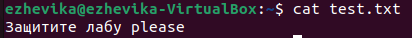

# Slide 1

 TEXT1

# slide 2 с кириллицей

Text 2 и русские буквы

$$
\sqrt{\frac{42}{37}}
$$

# рисунки



# Подсветка синтаксиса

```cpp
#include <iostream>

int main()
{
    std::cout << "hello";
}
```

# ссылки
Текст содержит [одну ссылку][link1]. И ещё одну [ссылку][link2] в тексте.

# Много кода

```cpp
#include <cstdio>
#include <algorithm>

int main() {
	long long a1, a2, a3, a4;
	scanf("%lld %lld %lld %lld", &a1, &a2, &a3, &a4);
	long long s = std::min(a1, a2) + std::min(a3, a4);
	long long left = 0;
	long long right = 2000 * 1000 * 1000;
	while (left + 1 < right) {
		long long mid = (left + right) / 2;
		if (mid * mid <= s) {
			left = mid;
		}
		else {
			right = mid;
		}
	}
	printf("%lld", left);
	return 0;
}
```


[link1]: www.google.com "Всплывающая подсказка"
[link2]: www.ya.ru "ссылка на yandex"
