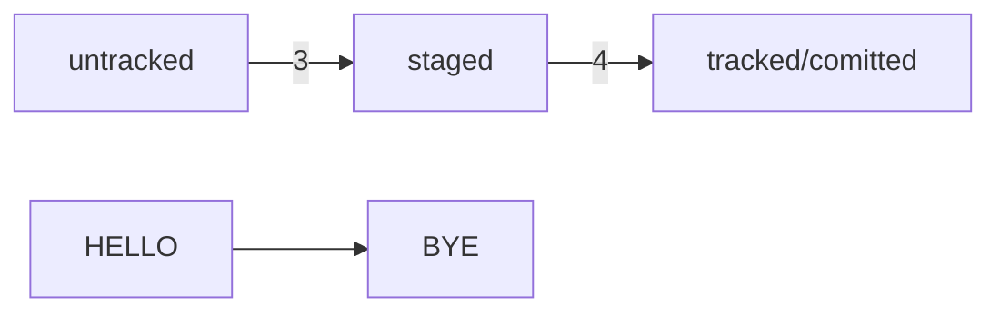

# Лабораторная работа №2
## Начало работы c Git
Алехнович В.В.
## Знакомство с GitHub

## О чём этот модуль
Git — это система контроля версий, которая помогает отслеживать изменения в проекте. Этот инструмент можно использовать как для индивидуальной, так и для командной работы.
Git позволяет сохранять изменения локально и при необходимости возвращаться к предыдущим версиям проекта. Также можно создать удалённую копию на хостинг-платформе, которая работает с Git, и поделиться результатом с другими.
В этом модуле вы погрузитесь в самостоятельную работу над Git-проектом. А именно:
 - создадите Git-репозиторий, добавите в него файлы и сделаете свой первый коммит;
 - познакомитесь с GitHub — самой популярной платформой для хранения IT-проектов и командной работы над ними;
 - научитесь синхронизировать локальный репозиторий, который хранится у вас на компьютере, с удалённым — тем, который вы заведёте на GitHub;
 - изучите понятия хеш, лог, HEAD и другие — они помогут вам ориентироваться в коммитах;
 - узнаете, как работать с изменениями и правильно оформлять коммиты.
 - концу модуля вы сможете создавать Git-проекты и «откатываться» к предыдущим версиям, если что-то пошло не так. А ещё потренируетесь сохранять изменения в удалённой копии — её можно отправить друзьям или коллегам, чтобы похвастаться или спросить совета.

## Инициализируем репозиторий
В этом уроке покажем, как инициализировать Git-репозиторий и проверить, что всё прошло
успешно.

### Сделать папку репозиторием — git init

Чтобы Git начал отслеживать изменения в проекте, папку с файлами этого проекта нужно сделать Git-репозиторием (от англ. repository — «хранилище»). Для этого следует переместиться в неё и ввести команду git init (от англ. initialize — «инициализировать»).
Например, создайте папку first-project и сделайте её Git-репозиторием: перейдите в неё с
помощью команды cd и выполните git init.
```
$ cd ~/dev/first-project # перешли в нужную папку
$ git init # создали репозиторий
```


### «Разгитить» папку, если что-то пошло не так, — rm -rf .git

Если вы случайно сделали Git-репозиторием не ту папку, её можно «разгитить». Для этого нужно
удалить скрытую подпапку .git.
```
$ cd <папка с репозиторием> # перешли в папку
$ rm -rf .git # удалили подпапку .git
```


### Проверить состояние репозитория — git status

После инициализации репозитория first-project запустите команду git status (от англ. status — «статус», «состояние») — она показывает текущее состояние репозитория.


## Добавляем файлы в репозиторий
Вы инициализировали Git-репозиторий, но в нём пока ничего нет. В этом уроке разберём, как
добавить туда файлы.

### Подготовить файлы к сохранению — git add
Добавим в репозиторий два файла. Например, файл todo.txt, в котором будет список дел, и
readme.txt для информации о проекте. Pапустите git status, чтобы
посмотреть, что изменилось.


Сейчас в first-project два файла. Мы хотим отслеживать состояние обоих, поэтому можем использовать команду git add --all (от англ. add — «добавить» + от англ. all — «всё»). Ключ, или флаг, --all позволяет подготовить к сохранению все файлы в репозитории.
```
$ git add --all # подготовили к сохранению все файлы в репозитории
$ git status # проверили статус
```


Команда git add не сохраняет содержимое файлов в репозитории. Само сохранение, или фиксацию состояния файлов, называют коммитом (от англ. commit — «совершать», «фиксировать»). «Сделать коммит» значит сохранить текущую версию файла.
Например, откройте файл todo.txt в любом редакторе (подойдёт даже блокнот) и напишите в нём:


Сохраните изменения, а затем снова вызовите команду git status в консоли.


Подытожим:
 - Команда git add позволяет подготовить файл к сохранению.
 - Команда git add --all подготовит к сохранению сразу все файлы.
 - С помощью git add . можно добавить в репозиторий текущую папку со всеми файлами.

Чтобы запомнить новое состояние файла, нужно снова ввести команду git add и передать в
качестве параметра имя изменённого файла или ключ --all.
```
$ git add todo.txt
# или
$ git add --all
```

## Делаем первый коммит
Коммит — это одна из основных сущностей в Git (и в других системах контроля версий). Коммит гарантирует, что изменения будут сохранены в истории и при необходимости к ним можно будет «откатиться». Это как если бы вы могли выполнить операцию Ctrl+Z для целой папки (репозитория).

###Выполнить коммит — git commit

Сделать коммит можно командой git commit c ключом -m (от англ. message — «сообщение»),
который присваивает коммиту сообщение.

Например, перейдите в папку first-project и выполните коммит со следующим комментарием.
```
$ git commit -m ‘Мой первый коммит!’
```


Задание для самостоятельной работы
Попробуйте самостоятельно сделать несколько коммитов в репозитории first-project.
1. Откройте файл readme.txt в любом редакторе (например, в блокноте).
2. Добавьте в файл описание проекта.


3. Сделайте коммит с подходящим сообщением.


4. В файле todo.txt замените строку «1. Пройти пару уроков Git.» на строку «1. Пройти
пару тем Git.».


5. Сделайте ещё один коммит.


Поздравляем с первыми коммитами! Напомним, о чём мы рассказали:
 - Коммит можно сделать с помощью команды git commit.
 - Ключ -m позволяет присвоить коммиту сообщение. Помните, что такие сообщения
должны быть информативными: чётко описывать изменения.
 - В коммит попадает то, что было предварительно добавлено «в корзину», или «в кадр»,
перед коммитом.

## Просматриваем историю коммитов
В этом уроке разберём, как вывести историю коммитов, — это понадобится для отслеживания того,что происходит в репозитории.

### Просмотреть историю коммитов — git log
В самостоятельном задании прошлого урока вы сделали три коммита в ваш репозиторий. Чтобы
увидеть их все, введите команду git log (от англ. log — «журнал [записей]»).


## Знакомство с GitHub

До этого момента вы использовали Git локально: сейчас проект first-project хранится только на вашем компьютере. Но одно из ключевых преимуществ Git — удобство командной работы над файлами. Чтобы поделиться репозиторием — например, с коллегами, — нужно завести его удалённую версию.

## Создаём удалённый репозиторий


Готово! Удалённый репозиторий создан. Страница с ним открывается автоматически.

## Что такое SSH. Генерируем SSH-ключ
Представьте, что у вас есть ключ от двери, за которой хранится важный документ. Чтобы получить доступ к этому документу, вам нужно вставить ключ в замочную скважину и повернуть его. Поскольку ключ есть только у вас, ваш документ надёжно защищён от посторонних глаз.
Чтобы получить доступ к репозиторию на GitHub, вам тоже нужно предоставить ключ, который
подтверждает вашу личность и права на чтение или изменение данных. Без этого ключа доступ будет ограничен.

## Что такое SSH
Когда компьютеры обмениваются данными в сети, они следуют сетевым протоколам (англ.
network protocols) — правилам обмена данными между компьютерами.
Один из наиболее распространённых сетевых протоколов — SSH (от англ. Secure Shell Protocol).
Он обеспечивает безопасный обмен данными в сети. С помощью этого протокола можно получать данные с удалённого компьютера или отправлять их на него. Трафик шифруется, поэтому протокол безопасен.

## Проверка наличия SSH-ключа
Прежде чем генерировать SSH-ключи, убедитесь, что у вас их ещё нет. По умолчанию директория с SSH-ключами находится в домашней директории пользователя. Перейдите в неё.
```
$ cd ~ # перешли в домашнюю директорию
```
Обычно SSH-ключи находятся в директории .ssh/. Проверить наличие этой директории и файлов в ней можно с помощью следующей команды.
```
$ ls -la .ssh/ # вывели список созданных ключей
```
Если папка пустая или её нет, всё в порядке.


## Инструкция по генерации SSH-ключа

Для генерации SSH-пары можно использовать программу ssh-keygen. Откройте терминал
и введите следующую команду.
```
$ ssh-keygen -t ed25519 -C "электронная почта, к которой привязан ваш аккаунт на GitHub"
```
Используйте электронную почту, к которой привязан ваш GitHub-аккаунт.
Если вы видите сообщение об ошибке, то, скорее всего, ваша система не поддерживает алгоритм шифрования ed25519. Ничего страшного: используйте другой алгоритм.
```
$ ssh-keygen -t rsa -b 4096 -C "электронная почта, к которой привязан ваш аккаунт на
GitHub"
```
После ввода отобразится такое сообщение.
```
> Generating public/private rsa key pair. # сгенерированы публичный и приватный ключи
```


Готово! Теперь осталось проверить, что ключи действительно сгенерировались. Для этого
вызовите команду ls -a ~/.ssh.


Замечательно! Подведём итоги:
- SSH — протокол, который обеспечивает безопасный обмен данными в сети и использует
для этого ключи.
 - SSH-ключ — ваш виртуальный идентификатор в GitHub. Как ключ от квартиры, он
позволяет получить доступ к GitHub-репозиторию. Также SSH используется для доступа к
другим удалённым серверам.
 - SSH-ключ состоит из двух частей — публичной и приватной. Публичный ключ
зашифрует данные, а приватный — расшифрует. Приватным ключом ни в коем случае нельзя
делиться, иначе любой сможет расшифровать все ваши секреты!

## Привязываем SSH-ключ к GitHub

В прошлом уроке вы сгенерировали SSH-ключ, но он пока не привязан к аккаунту на GitHub.
Исправим это.

### Инструкция по связыванию SSH-ключа и GitHub-аккаунта
1. После выполнения команды ssh-keygen из предыдущего урока в директории ~/.ssh будет
создано два файла — id_ed25519 и id_ed25519.pub (или id_rsa и id_rsa.pub — в зависимости от того, какой алгоритм вы использовали):
o id_ed25519/id_rsa — приватный ключ (файл без .pub в конце). Ни в коем случае не
копируйте его и не делитесь им.
o id_ed25519.pub/id_rsa.pub — публичный ключ (на это указывает расширение .pub).

Скопируйте содержимое файла с публичным ключом в буфер обмена.
```
# установить утилиту xclip
$ sudo apt install xclip
# скопировать в буфер обмена содержимое файла ~/.ssh/id_rsa.pub
$ cat ~/.ssh/id_rsa.pub | xclip –i –selection clip
или
$ cat ~/.ssh/id_rsa.pub | xclip –sel c
```


2. Перейдите на GitHub и выберите пункт Settings (англ. «настройки») в меню аккаунта.
3. В меню слева нажмите на пункт SSH and GPG keys.
4. В открывшейся вкладке выберите New SSH key (англ. «новый SSH-ключ»).
5. В поле Title (англ. «заголовок») напишите название ключа. Например, Personal key (англ.
«личный ключ»).
6. В поле Key type (англ. «тип ключа») должно быть Authentication Key (англ. «ключ
аутентификации»).
7. В поле Key скопируйте ваш ключ из буфера обмена.
8. Нажмите на кнопку Add SSH key (англ. «добавить SSH-ключ»).


 
9. Проверьте правильность ключа с помощью следующей команды.
```
$ ssh -T git@github.com
```


## Связываем локальный и удалённый репозитории
Сейчас у вас есть локальный репозиторий first-project, который хранится на вашем компьютере, и удалённый репозиторий на GitHub. Вы сгенерировали SSH-ключ для безопасной работы и теперь готовы связать удалённый репозиторий с локальным.
## Привязать удалённый репозиторий к локальному — git remote add
Перейдите на страницу удалённого репозитория, выберите тип SSH и скопируйте URL. Кнопка
справа позволит сделать это мгновенно.


Откройте консоль, перейдите в каталог локального репозитория и введите команду git remote add
(от англ. remote — «удалённый» и add — «добавить»).
```
$ cd ~/dev/first-project
$ git remote add origin git@github.com:%ИМЯ_АККАУНТА%/first-project.git
```
Команде необходимо передать два параметра: имя удалённого репозитория и его URL. В качествеимени используйте слово origin. А URL вы скопировали со страницы удалённого репозитория.


## Убедиться, что репозитории связаны, — git remote -v
Отлично: вы связали локальный репозиторий с удалённым. Осталось убедиться, что всё работает, с помощью следующей команды.
```
$ git remote -v
origin git@github.com:%ИМЯ_АККАУНТА%/%ИМЯ-ПРОЕКТА%.git (fetch)
origin git@github.com:%ИМЯ_АККАУНТА%/%ИМЯ-ПРОЕКТА%.git (push)
```


Локальный и удалённый репозитории связаны!

## Синхронизируем локальный и удалённый репозитории

Вы зарегистрировались на GitHub, сгенерировали SSH-ключ и привязали локальный репозиторий к удалённому. Самое сложное позади! Теперь разберём, как выкладывать свои правки на удалённый репозиторий.

Задание для самостоятельной работы
1. Откройте проект first-project и создайте в нём файл task.txt с помощью touch.
2. Откройте файл task.txt в текстовом редакторе и внесите любые изменения. Затем
сохраните и закройте файл.


3. Сделайте коммит и синхронизируйте изменения с удалённым репозиторием.


4. Воспользуйтесь интерфейсом GitHub, чтобы посмотреть ваш последний коммит. Для
этого нажмите на имя коммита.


## Файл README.md
Чтобы другие пользователи, а также потенциальные клиенты или работодатели могли понять, что
представляет собой проект, его нужно описать. Такое описание принято указывать в файле README.md (от
англ. read — «прочитай» и me — «меня»). В этом уроке вы научитесь оформлять такие файлы.

## Задание для самостоятельной работы

Потренируйтесь использовать маркдаун. Оформите файл README.md для репозитория first-project.
Сейчас в нём есть файл readme.txt, который вы создали в начале модуля. Удалите файл и создайте
новый с расширением .md.
```
$ cd ~/dev/first-project
$ rm readme.txt
$ touch README.md
# затем файл README.md можно редактировать как обычно
# с помощью любого текстового редактора (например, блокнота)
```


Отлично: теперь вы умеете оформлять файл README.md — он поможет другим пользователям узнать больше о проекте, который вы разместили в вашем репозитории!

# Практическая работа No1. «Делимся проектом с миром»
1. Создайте репозиторий.
2. Добавьте в репозиторий файл README.md и запишите в него всё, что уже знаете. Это могут быть: список команд и понятий по каждой из пройденных тем; инструкции по инициализации проекта, работе с коммитами и регистрации на GitHub или просто поурочные конспекты в свободной форме.
3. Загрузите получившийся репозиторий на GitHub и убедитесь, что локальная и удалённая версии идентичны.


# Практическая работа No2. Дополняем шпаргалку

1) Добавим в шпаргалку основную информацию из уроков о хеше, логе HEAD, статусах файлов оформлении сообщений к коммитам.
2) 2)ИНформацию из каждого урока заливаем новым коммитом. Так вам будет проще отслеживать, как меняется шпаргалка  и увеличиваться объём наших знаний.
3) 3) Особое внимание уделим материалу о статусах и жизненном цикле файлов Git. Схему изменения статусов можно описать словами. Например

```
modified +git add = staged
```
Попробуем использовать формат описания схем Mermaid. Принцип такой: вы описываете схему в специальном текстовом формате, а GitHub превращает описание в полноценную схему с блоками и стрелками.
Заготовка для схемы статусов файлов.



# Практическая работа №3. Нужно откатить изменения

## Когда написаk ненужное

```
git restore <file>
```

## Когда уже накоммитил

```
git reset --hard <time travel!>
```
## Игнорирование файлов в Git

Чтобы Git игнорировал файлы и не пытаося добавить их в репозиторий, нужно создать файл .gitignore и записать в него названия игнорируемых файлов. В этом уроке написано, как это сделать.

.gitignore -  это обычный текстовый файл, который добавляют в корень репозитория и коммитят. В нём указывают все файлы, которые надо игнорировать (по одному имени на строку).

## Правила для .gitignore

- Если строка начинается с #, то это комментарий и он не учитывется
- Простое название файла. Например все файлы .DS_Store:

```
.DS_Store
```
- Если *, то файл будет проигнорирован вне зависимости от того, что будет вместо *

```
#игнорировать все файлы, которые заканчиваются на .jpeg
*.jpeg
```

-Вопросительный знак соотвествует одному любому символу.

```
file?.txt - будут проигнорированы файлы, такие как fileA, file1
```

- Квадратные скобки как и вопросительный, только указывает определеные символы для игнора.

```
file[0-2].txt - игнорировать все файлы file0, file1, file2 но не игнорировать file3, file4
```

-слеш указывает на каталоги. Если шаблон в .gitignore начинается со слеша, то Git проигнорирует файлы или каталоги только в корневой директории.
-Функция парных звёздочек (**) похожа на функцию одинарной (*). Отличие в том, как они работают с вложенными папками. Двойная звёздочка может соответствовать любому количеству таких папок (в том числе нулю). Одинарная может соответствовать только одной.
-восклицательный зеак инвертирует любое правило .gitignore

```
игнорировать все файлы JPEG но только не мем с Doge
*jpeg.
!doge.jpeg
```

## Пример файла .gitignore
```
build/
*.log
!examples/**/*.log

Игнорировать все файлы в каталоге build, игнорировать все файлы .log, не игнорировать *.log файлы в examples.
```
## .gitignore и git status
Игнорируемые файлы не отображаются в выводе команды *git status*. Чтобы их увидеть надо ввести ключ *--ignored: git status --ignored*. В таком случае в выводе *git status* появится раздел *Ignored files*.

# Практическая работа №4. Исследуем историю коммитов

В процессе понадобятся команды `git log` и `git diff`. Эти команды не раз пригодятся в реальной работе — для анализа текущего состояния репозитория и поиска ошибок или чтобы просто разобраться, откуда в проекте появилось изменение.

## Шпаргалка. Начало работы с Git

## Инициализация репозитория

git init - инициализируй репозиторий.

## Синхронизация локального и удалённого репозиториев

`git remote add origin`
`git remote -v`
`git push -u origin main`

## Подготовка файла к коммиту

`git add`
`git add --all`

## Создание и публикация коммита

`git commit -m "комментарий"`
`git push`

## просмотр информации о коммитах

`git log`
`git log --oneline`

## Просмотр состояния файлов
`git status`

## Добавление изменений в последний коммит
`git commit --amend --no-edit`
`git commit --amend -m`

## Откат файлов и коммитов
`git restore --staged .txt`
`git restore .txt`
`git restore --hard .txt`

